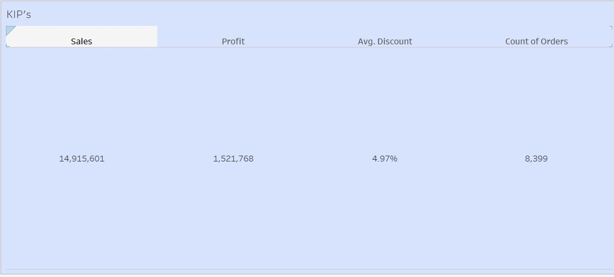
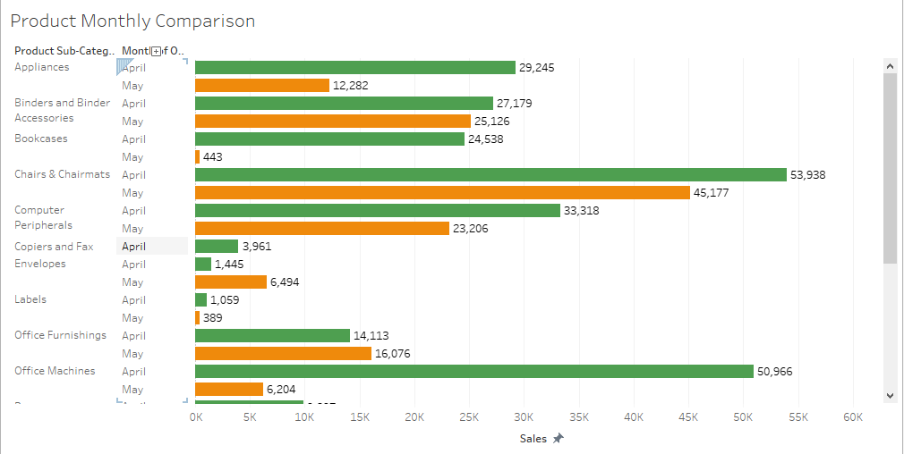
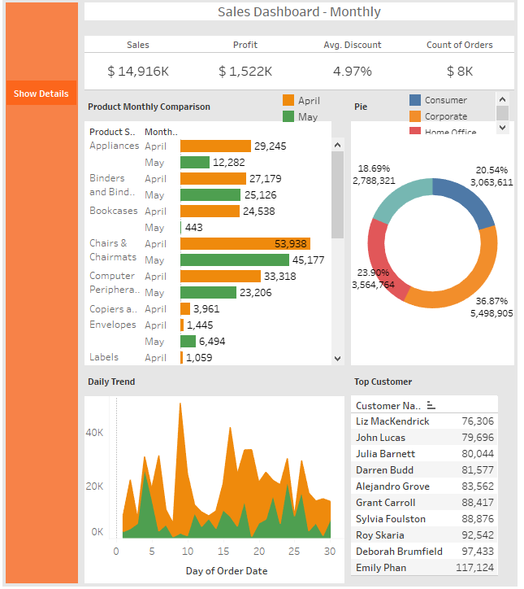

# Tablue_Dashboard_
 
# Stage 1 
**Creating 4 KPI's for Dashboard**
 - No need to focus on formating
 - Creating 4 Important KPI's for Dashboard
 
 

 
 # Stage 2 
 **Creating Charts**
 - Create different charts based on data available
 - Chart Layout ( Titel , Lebal , Colour)
 
 
 
 
 # Stage 3 
 **Creating Dashboard**
 - Arrange all KPI's and Chart on Dashboard
 - Creating Nevigate Panal
 - Creating Dynamic charts or details ( Using Show / Hide Button )
 - Focus on formating
 - Focus on Fonts , Spacing.
 
